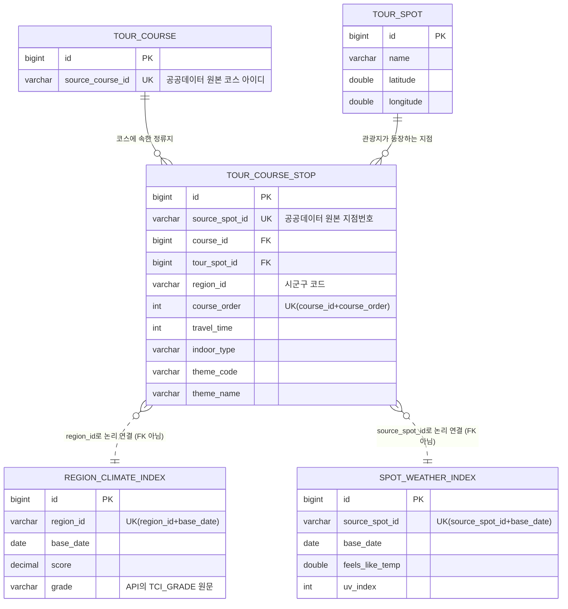

# 테이블 명세서 — TripCast 관광코스 날씨/관광기후지수 서비스

`tour_spot`, `tour_course`, `tour_course_stop`은 기존 구현된 테이블이고,
`region_climate_index`, `spot_weather_index`는 관광기후지수 연동을 위해 신규 설계된 테이블이다.

## ERD



## DDL (MySQL)

```sql
CREATE TABLE tour_spot (
    id BIGINT AUTO_INCREMENT PRIMARY KEY,
    name VARCHAR(255),
    latitude DOUBLE,
    longitude DOUBLE
);

CREATE TABLE tour_course (
    id BIGINT AUTO_INCREMENT PRIMARY KEY,
    source_course_id VARCHAR(20) NOT NULL,
    CONSTRAINT uk_tour_course_source_id UNIQUE (source_course_id)
);

CREATE TABLE tour_course_stop (
    id BIGINT AUTO_INCREMENT PRIMARY KEY,
    source_spot_id VARCHAR(20) NOT NULL,
    course_id BIGINT NOT NULL,
    tour_spot_id BIGINT NOT NULL,
    region_id VARCHAR(20) NOT NULL,
    course_order INT NOT NULL,
    travel_time INT NOT NULL,
    indoor_type VARCHAR(10) NOT NULL,
    theme_code VARCHAR(10) NOT NULL,
    theme_name VARCHAR(50) NOT NULL,
    CONSTRAINT uk_course_stop_source_id UNIQUE (source_spot_id),
    CONSTRAINT uk_course_stop_order UNIQUE (course_id, course_order),
    CONSTRAINT fk_course_stop_course FOREIGN KEY (course_id) REFERENCES tour_course(id),
    CONSTRAINT fk_course_stop_spot FOREIGN KEY (tour_spot_id) REFERENCES tour_spot(id)
);

CREATE TABLE region_climate_index (
    id BIGINT AUTO_INCREMENT PRIMARY KEY,
    region_id VARCHAR(20) NOT NULL,
    base_date DATE NOT NULL,
    score DECIMAL(5, 2) NOT NULL,
    grade VARCHAR(20) NOT NULL,
    CONSTRAINT uk_region_climate_date UNIQUE (region_id, base_date)
);

CREATE TABLE spot_weather_index (
    id BIGINT AUTO_INCREMENT PRIMARY KEY,
    source_spot_id VARCHAR(20) NOT NULL,
    base_date DATE NOT NULL,
    feels_like_temp DOUBLE,
    uv_index INT,
    CONSTRAINT uk_spot_weather_date UNIQUE (source_spot_id, base_date)
);
```

## 테이블 명세

### 1. tour_spot (관광지)

**설명**: 관광지 기준정보. 이름과 좌표만 보유하며 CSV 최초 적재 후 거의 변경되지 않음.
**데이터 출처**: `src/main/resources/data/tour_spots.csv` (기상청 관광코스별 관광지 상세날씨 조회 지점 정보)
**갱신 방식**: 수동/1회성 배치 적재 (`TourSpotDataImporter`)

| 컬럼명 | 타입 | PK | FK | NULL | 설명 |
|---|---|---|---|---|---|
| id | BIGINT | ● | | N | 내부 식별자 (Auto Increment) |
| name | VARCHAR(255) | | | Y | 관광지명 |
| latitude | DOUBLE | | | Y | 위도 |
| longitude | DOUBLE | | | Y | 경도 |

**인덱스/제약**: 없음 (단, 서비스 로직에서 `name + latitude + longitude` 조합으로 중복 조회)

---

### 2. tour_course (관광코스)

**설명**: 관광코스 기준정보. 공공데이터 원본 코스 아이디만 보유하고, 실제 구성은 `tour_course_stop`에서 관리.
**데이터 출처**: `tour_spots.csv`의 `코스 아이디` 컬럼
**갱신 방식**: `tour_spot`과 동일

| 컬럼명 | 타입 | PK | FK | NULL | 설명 |
|---|---|---|---|---|---|
| id | BIGINT | ● | | N | 내부 식별자 (Auto Increment) |
| source_course_id | VARCHAR(20) | | | N | 원본(공공데이터) 코스 아이디 |

**인덱스/제약**
- `uk_tour_course_source_id` UNIQUE(`source_course_id`) — 동일 코스 중복 적재 방지

---

### 3. tour_course_stop (코스-관광지 연결)

**설명**: 코스와 관광지를 잇는 연결 테이블. 코스 내 순서·이동시간·실내외 구분·테마 정보를 함께 보유. `tour_course`(N) : `tour_spot`(N) 관계를 중개.
**데이터 출처**: `tour_spots.csv` 전체 행
**갱신 방식**: `tour_spot`과 동일

| 컬럼명 | 타입 | PK | FK | NULL | 설명 |
|---|---|---|---|---|---|
| id | BIGINT | ● | | N | 내부 식별자 (Auto Increment) |
| source_spot_id | VARCHAR(20) | | | N | 원본(공공데이터) 지점번호 |
| course_id | BIGINT | | ● → tour_course.id | N | 소속 코스 |
| tour_spot_id | BIGINT | | ● → tour_spot.id | N | 연결된 관광지 |
| region_id | VARCHAR(20) | | | N | 시군구 코드 (관광기후지수 조회 키) |
| course_order | INT | | | N | 코스 내 방문 순서 |
| travel_time | INT | | | N | 다음 지점까지 이동시간(분) |
| indoor_type | VARCHAR(10) | | | N | 실내/실외/미상 |
| theme_code | VARCHAR(10) | | | N | 테마 분류 코드 |
| theme_name | VARCHAR(50) | | | N | 테마명 |

**인덱스/제약**
- `uk_course_stop_source_id` UNIQUE(`source_spot_id`) — 동일 지점 중복 적재 방지
- `uk_course_stop_order` UNIQUE(`course_id`, `course_order`) — 한 코스 내 순서 중복 방지
- `fk_course_stop_course` FK(`course_id`) REFERENCES `tour_course(id)`
- `fk_course_stop_spot` FK(`tour_spot_id`) REFERENCES `tour_spot(id)`

---

### 4. region_climate_index (시군구 관광기후지수) — 신규

**설명**: 시군구 단위 관광기후지수를 일자별로 적재하는 시계열 캐시 테이블. 하루 한 지역당 한 행.
**데이터 출처**: 기상청 "관광코스별 관광지 상세 날씨 조회서비스" OpenAPI (data.go.kr 15056912)
**갱신 방식**: 매일 배치 (`ClimateIndexSyncScheduler`, 매일 05:00) — `tour_course_stop`에 등록된 `region_id` 목록 대상 upsert

| 컬럼명 | 타입 | PK | FK | NULL | 설명 |
|---|---|---|---|---|---|
| id | BIGINT | ● | | N | 내부 식별자 (Auto Increment) |
| region_id | VARCHAR(20) | | | N | 시군구 코드 (`tour_course_stop.region_id`와 값으로 연결, FK 아님) |
| base_date | DATE | | | N | 지수 기준일 |
| score | DECIMAL(5, 2) | | | N | 관광기후지수 점수 (`kmaTci`, 예: `0.44`) |
| grade | VARCHAR(20) | | | N | 공공데이터포털 응답의 `TCI_GRADE` 원문 |

**인덱스/제약**
- `uk_region_climate_date` UNIQUE(`region_id`, `base_date`) — 배치 재실행 시 upsert 보장, 하루 중복 적재 방지
- `region_id`, `base_date` 복합 조회 인덱스 권장 (조회 API의 핵심 WHERE 조건)

**비고**: `tour_course_stop`과 물리적 FK 없음. 시계열 데이터 특성상 조회 시점에 `region_id + base_date`로 논리 조인.

---

### 5. spot_weather_index (관광지 기상지수) — 신규

**설명**: 관광지 단위 기상지수(체감온도, 자외선지수 등)를 일자별로 적재하는 시계열 캐시 테이블.
**데이터 출처**: 기상청 "관광코스별 관광지 상세 날씨 조회서비스" OpenAPI (data.go.kr 15056912)
**갱신 방식**: 현재 공개 API에 대응 필드가 없어 미적재. 향후 API 필드가 다시 제공될 때 같은 배치에서 처리

| 컬럼명 | 타입 | PK | FK | NULL | 설명 |
|---|---|---|---|---|---|
| id | BIGINT | ● | | N | 내부 식별자 (Auto Increment) |
| source_spot_id | VARCHAR(20) | | | N | 원본 지점번호 (`tour_course_stop.source_spot_id`와 값으로 연결, FK 아님) |
| base_date | DATE | | | N | 지수 기준일 |
| feels_like_temp | DOUBLE | | | Y | 체감온도 |
| uv_index | INT | | | Y | 자외선지수 |

**인덱스/제약**
- `uk_spot_weather_date` UNIQUE(`source_spot_id`, `base_date`)

**비고**: 공공데이터포털 15056912의 현재 Swagger에는 관광지별 체감온도/자외선지수 기능이 공개되어 있지 않다. 엔티티와 테이블은 기존 설계 호환을 위해 유지하되 임의 계산값은 적재하지 않는다.

---

## 테이블 간 관계 요약

| 관계 | 유형 | 방식 |
|---|---|---|
| tour_course 1 : N tour_course_stop | 식별관계 | FK (`fk_course_stop_course`) |
| tour_spot 1 : N tour_course_stop | 식별관계 | FK (`fk_course_stop_spot`) |
| tour_course_stop N : 1 region_climate_index | 논리관계 | `region_id` 값 매칭 (FK 없음) |
| tour_course_stop N : 1 spot_weather_index | 논리관계 | `source_spot_id` 값 매칭 (FK 없음) |
